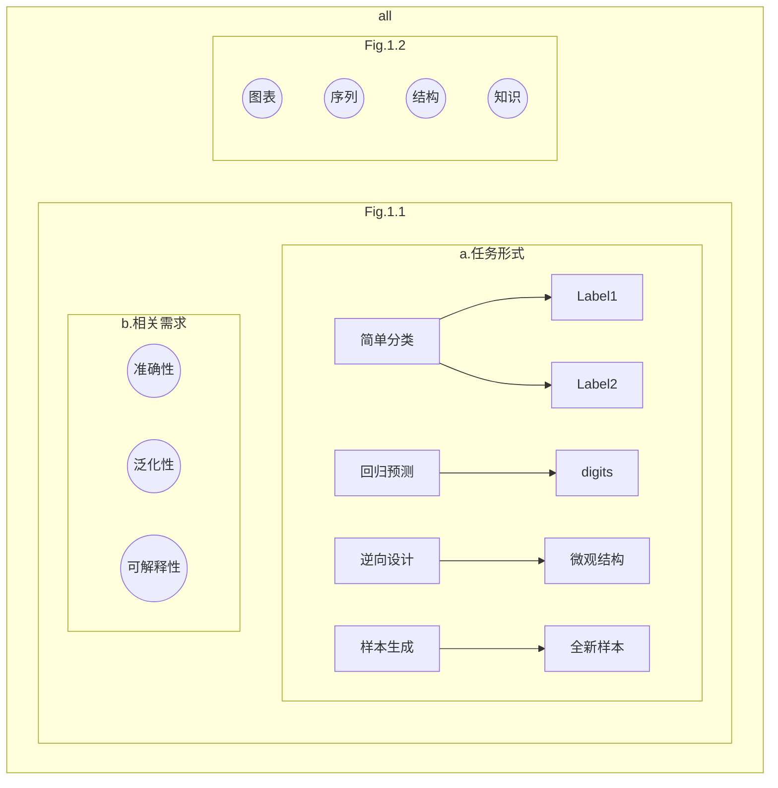

# Conducting multimodal analysis in natural science applications through the integration of Knowledge Graph and Large Language model encoding

## 1. Purpose
在自然科学领域，研究任务呈现出多样化与复杂性。基础任务涉及对样本或系统的分类与预测，而高级任务则涵盖微观结构的逆向计算及未知样本的自主生成等。随着科研活动的不断深化，任务复杂性逐渐增加，涉及的知识形式亦趋复杂，如图表、序列、结构等。此类复杂性不仅加剧了研究人员的负担，还导致大量重复性工作。

为应对上述挑战，自然科学与计算机科学领域的机器学习、人工智能等先进技术实现交叉融合，旨在高效处理复杂科研任务。然而，现有机器学习模型在准确性、可解释性及泛化能力方面仍存在局限。本研究旨在探索一种新型框架，该框架能够接纳多模态信息输入，处理复杂的任务结构，并在自然科学问题处理中展现出较高的可解释性与泛化能力。

## 2. Method

从图结构出发，引入知识图谱，引入大模型的编码方式，参考使用了任务图的方式

## 3. Advantage

图结构可以处理复杂的任务形式，可以更充分地保存任务地相关信息。我们采用了任务图的形式。。。
知识图谱可以用于提供准确，可解释，追溯的答案生成。大模型编码可以：另一方面，通过大模型对知识图谱进行语义编码，可以将不同形式，不同结构的知识映射到相同的潜空间。在传统的机器学习模型训练中，在特定数据集上训练的模型通常不具备优秀的分布外泛化性，在新数据，新样本，新任务上的表现差强人意，然而，文字作为一种通用的表达形式，原则上可以表述存在于人类认知范畴内的一切事物，通过文字描述训练样本的相关信息，并采用大模型将其映射到统一的语义空间内，在特定数据集上训练的模型就可能学习可用于相关任务的语义知识，而不是数据集的分布本身，从而获取分布外的泛化能力。另一方面，图结构相较于单纯的文本，可以包含更丰富的内容。因此考虑使用图结构作为训练的样本，通过与知识图谱相融合，并用文字进行描述，可以实现相关的泛化性。
