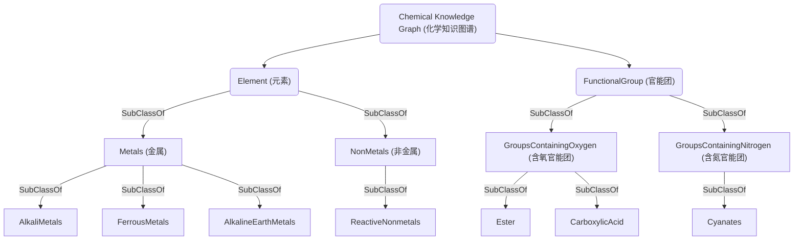

# 化学知识图谱说明

知识图谱是模型输出结构提供可解释性和可追溯提供依据的重要工具，它通过构建实体、关系和属性之间的复杂网络，有效地整合了多源异构的数据。这种整合不仅能够清晰地展现知识之间的关联，还为深入理解模型的决策过程和输出结果提供了坚实的基础。在实际应用中，知识图谱能够帮助研究人员和开发者更好地设计算法的内在逻辑，从而对模型进行优化和改进。同时，知识图谱也为模型的可追溯性提供了有力支持，使得在面对复杂的模型输出时，可以迅速回溯到相关的知识源头，以验证和解释结果的合理性。

在现阶段的研究工作中，我们局限于使用人工设计的逻辑进行任务图与知识图谱的整合，这一方法在处理复杂任务和动态知识场景时，其适应性及泛化能力受到限制。因此，我们计划在后续研究中引入基于大语言模型的图增强方法，以实现知识的自动关联和图谱的智能重构，旨在提高系统对知识的深度挖掘和利用效率，从而增强模型的鲁棒性和智能水平。

## 图谱结构

相关知识图谱部分来自于 **Knowledge graph-enhanced molecular contrastive learning with functional prompt**^[https://www.nature.com/articles/s42256-023-00654-0]。 其简化结构如下所示
&nbsp;

&nbsp;
该图谱的原始形式采用owl格式，方便知识的储存与检索；而在我们的相关研究中以图结构为主，需要进行节点，边线的添加与删减，因此以networkx的图格式为主，需要将相应的格式进行转换。相关的转换大部分已经完成，但仍有部分信息没有进行处理，后期需要做进一步的完善处理以及相关的检查，确保没有生成错误的知识。

知识图谱的官能团分级和补充会在下一节中进行详述，此处以元素的相关内容为主。

### Element(元素)

* **知识图谱中有关化学元素的相关分类如下所示**

<table>
    <tr>
        <td>Level1</td>
        <td>Level2</td>
        <td>Level3</td>
   </tr>
    <tr>
        <td rowspan="25">Element</td>
        <td rowspan="9">metals (金属)</td>
        <td>alkalineEarthMetals
        (碱土金属)</td>
    </tr>
    <tr>
        <td>lanthanides
        (镧系元素)</td>
    </tr>
    <tr>
        <td>blackMetals
        (黑色金属)</td>
    </tr>
    <tr>
        <td>ferrousMetals
        (铁金属)</td>
    </tr>
    <tr>
        <td>alkaliMetals
        (碱金属)</td>
    </tr>
    <tr>
        <td>actinides
        (锕系元素)</td>
    </tr>
    <tr>
        <td>nonferrousMetals
        (有色金属)</td>
    </tr>
    <tr>
        <td>postTransitionMetals
        (过渡后金属)</td>
    </tr>
    <tr>
        <td>transitionMetals
        (过渡金属)</td>
    </tr>
    <tr>
        <td rowspan="2">nonmetals (非金属)</td>
        <td>reactiveNonmetals (活性非金属)</td>
    </tr>
    <tr>
        <td>nobleGasses
        (惰性气体)</td>
    </tr>
    <tr>
        <td rowspan="4">metalloids (类金属)</td>
        <td>#Te</td>
    </tr>
    <tr>
        <td>#As</td>
    </tr>
    <tr>
        <td>#Si</td>
    </tr>
    <tr>
        <td>#At</td>
    </tr>
    <tr>
        <td>#Mt</td>
    </tr>
    <tr>
        <td>#Ds</td>
    </tr>
    <tr>
        <td>#Rg</td>
    </tr>
    <tr>
        <td>#Cn</td>
    </tr>
    <tr>
        <td>#Nh</td>
    </tr>
    <tr>
        <td>#Fl</td>
    </tr>
    <tr>
        <td>#Mc</td>
    </tr>
    <tr>
        <td>#Lv</td>
    </tr>
    <tr>
        <td>#Ts</td>
    </tr>
    <tr>
        <td>#Og</td>
    </tr>
</table>
&nbsp;

#### 1. 金属

* **alkalineEarthMetals (碱土金属)**

<table>
    <tr>
        <td>Level3</td>
        <td>Level4</td>
    </tr>
    <tr>
        <td rowspan="6">alkalineEarthMetals (碱土金属)</td>
        <td>#Ba</td>
    </tr>
    <tr>
        <td>#Be</td>
    </tr>
    <tr>
        <td>#Ca</td>
    </tr>
    <tr>
        <td>#Mg</td>
    </tr>
    <tr>
        <td>#Sr</td>
    </tr>
    <tr>
        <td>#Ra</td>
    </tr>
</table>
&nbsp;

* **lanthanides (镧系元素)**

<table>
    <tr>
        <td>Level3</td>
        <td>Level4</td>
    </tr>
    <tr>
        <td rowspan="15">lanthanides (镧系元素)</td>
        <td>#Er</td>
    </tr>
    <tr>
        <td>#Ce</td>
    </tr>
    <tr>
        <td>#Eu</td>
    </tr>
    <tr>
        <td>#Dy</td>
    </tr>
    <tr>
        <td>#Pr</td>
    </tr>
    <tr>
        <td>#Ho</td>
    </tr>
    <tr>
        <td>#Yb</td>
    </tr>
    <tr>
        <td>#Tb</td>
    </tr>
    <tr>
        <td>#La</td>
    </tr>
    <tr>
        <td>#Gd</td>
    </tr>
    <tr>
        <td>#Nd</td>
    </tr>
    <tr>
        <td>#Lu</td>
    </tr>
    <tr>
        <td>#Sm</td>
    </tr>
    <tr>
        <td>#Tm</td>
    </tr>
    <tr>
        <td>#Pm</td>
    </tr>
</table>
&nbsp;

* **blackMetals (黑色金属)**

<table>
    <tr>
        <td>Level3</td>
        <td>Level4</td>
    </tr>
    <tr>
        <td rowspan="3">blackMetals (黑色金属)</td>
        <td>#Fe</td>
    </tr>
    <tr>
        <td>#Cr</td>
    </tr>
    <tr>
        <td>#Mn</td>
    </tr>
</table>
&nbsp;

* **ferrousMetals (铁金属)**

<table>
    <tr>
        <td>Level3</td>
        <td>Level4</td>
    </tr>
    <tr>
        <td rowspan="3">ferrousMetals (铁金属)</td>
        <td>#Fe</td>
    </tr>
    <tr>
        <td>#Ni</td>
    </tr>
    <tr>
        <td>#Co</td>
    </tr>
</table>
&nbsp;

* **alkaliMetals (碱金属)**

<table>
    <tr>
        <td>Level3</td>
        <td>Level4</td>
    </tr>
    <tr>
        <td rowspan="6">alkaliMetals (碱金属)</td>
        <td>#Rb</td>
    </tr>
    <tr>
        <td>#Na</td>
    </tr>
    <tr>
        <td>#Li</td>
    </tr>
    <tr>
        <td>#K</td>
    </tr>
    <tr>
        <td>#Cs</td>
    </tr>
    <tr>
        <td>#Fr</td>
    </tr>
</table>
&nbsp;

* **actinides (锕系元素)**

<table>
    <tr>
        <td>Level3</td>
        <td>Level4</td>
    </tr>
    <tr>
        <td rowspan="15">actinides (锕系元素)</td>
        <td>#Pa</td>
    </tr>
    <tr>
        <td>#Fm</td>
    </tr>
    <tr>
        <td>#Bk</td>
    </tr>
    <tr>
        <td>#Am</td>
    </tr>
    <tr>
        <td>#Np</td>
    </tr>
    <tr>
        <td>#Md</td>
    </tr>
    <tr>
        <td>#Cm</td>
    </tr>
    <tr>
        <td>#U</td>
    </tr>
    <tr>
        <td>#Es</td>
    </tr>
    <tr>
        <td>#Cf</td>
    </tr>
    <tr>
        <td>#Th</td>
    </tr>
    <tr>
        <td>#Ac</td>
    </tr>
    <tr>
        <td>#Lr</td>
    </tr>
    <tr>
        <td>#No</td>
    </tr>
    <tr>
        <td>#Pu</td>
    </tr>
</table>
&nbsp;

* **nonferrousMetals (有色金属)**

<table>
    <tr>
        <td>Level3</td>
        <td>Level4</td>
        <td>Level5</td>
        <td>Level6</td>
        <td>Level7</td>
    </tr>
    <tr>
        <td rowspan="99">nonferrousMetals (有色金属)</td>
        <td rowspan="7">nonferrousLightMetals 有色轻金属</td>
        <td>#Ba</td>
    </tr>
    <tr>
        <td>#Na</td>
    </tr>
    <tr>
        <td>#K</td>
    </tr>
    <tr>
        <td>#Ca</td>
    </tr>
    <tr>
        <td>#Mg</td>
    </tr>
    <tr>
        <td>#Al</td>
    </tr>
    <tr>
        <td>#Sr</td>
    </tr>
    <tr>
        <td rowspan="53">rareMetals 稀有金属</td>
        <td rowspan="5">rareLightMetal 稀有轻金属</td>
        <td>#Ti</td>
    </tr>
    <tr>
        <td>#Rb</td>
    </tr>
    <tr>
        <td>#Li</td>
    </tr>
    <tr>
        <td>#Be</td>
    </tr>
    <tr>
        <td>#Cs</td>
    </tr>
    <tr>
        <td rowspan="4">rareScatteredMetals 稀有散射金属</td>
        <td>#Ga</td>
    </tr>
    <tr>
        <td>#Ge</td>
    </tr>
    <tr>
        <td>#In</td>
    </tr>
    <tr>
        <td>#Tl</td>
    </tr>
    <tr>
        <td rowspan="8">rareRefractoryMetals 稀有难熔金属</td>
        <td>#Mo</td>
    </tr>
    <tr>
        <td>#W</td>
    </tr>
    <tr>
        <td>#Ta</td>
    </tr>
    <tr>
        <td>#Zr</td>
    </tr>
    <tr>
        <td>#Hf</td>
    </tr>
    <tr>
        <td>#V</td>
    </tr>
    <tr>
        <td>#Re</td>
    </tr>
    <tr>
        <td>#Nb</td>
    </tr>
    <tr>
        <td rowspan="17">rareEarthMetals 稀土金属</td>
        <td rowspan="7">lightRareEarthMetals 轻稀土金属</td>
        <td>#Pr</td>
    </tr>
    <tr>
        <td>#La</td>
    </tr>
    <tr>
        <td>#Nd</td>
    </tr>
    <tr>
        <td>#Sm</td>
    </tr>
    <tr>
        <td>#Pm</td>
    </tr>
    <tr>
        <td>#Ce</td>
    </tr>
     <tr>
        <td>#Eu</td>
    </tr>
    <tr>
        <td rowspan="10">lightRareEarthMetals 重稀土金属</td>
        <td>#Er</td>
    </tr>
    <tr>
        <td>#Sc</td>
    </tr>
    <tr>
        <td>#Dy</td>
    </tr>
    <tr>
        <td>#Y</td>
    </tr>
    <tr>
        <td>#Tb</td>
    </tr>
    <tr>
        <td>#Ho</td>
    </tr>
    <tr>
        <td>#Yb</td>
    </tr>
    <tr>
        <td>#Gd</td>
    </tr>
    <tr>
        <td>Lu</td>
    </tr>
    <tr>
        <td>#Tm</td>
    </tr>
    <tr>
        <td rowspan="19">rareRadioactiveMetals 稀有放射性金属</td>
        <td>#Ac</td>
    </tr>
    <tr>
        <td>#No</td>
    </tr>
    <tr>
        <td>#Pu</td>
    </tr>
    <tr>
        <td>#Pa</td>
    </tr>
    <tr>
        <td>#Po</td>
    </tr>
    <tr>
        <td>#Md</td>
    </tr>
    <tr>
        <td>#Fm</td>
    </tr>
    <tr>
        <td>#Bk</td>
    </tr>
    <tr>
        <td>#Am</td>
    </tr>
    <tr>
        <td>#Np</td>
    </tr>
    <tr>
        <td>#Tc</td>
    </tr>
    <tr>
        <td>#Fr</td>
    </tr>
    <tr>
        <td>#Cm</td>
    </tr>
    <tr>
        <td>#U</td>
    </tr>
    <tr>
        <td>#Es</td>
    </tr>
    <tr>
        <td>Cf</td>
    </tr>
    <tr>
        <td>#Th</td>
    </tr>
    <tr>
        <td>#Lr</td>
    </tr>
    <tr>
        <td>#Ra</td>
    </tr>
    <tr>
        <td rowspan="8">nobleMetals 贵金属</td>
        <td>#Ru</td>
    </tr>
    <tr>
        <td>#Os</td>
    </tr>
    <tr>
        <td>#Au</td>
    </tr>
    <tr>
        <td>#Ag</td>
    </tr>
    <tr>
        <td rowspan="4">platinumGroupMetals 铂族金属</td>
        <td>#Rh</td>
    </tr>
    <tr>
        <td>#Pt</td>
    </tr>
    <tr>
        <td>#Pd</td>
    </tr>
    <tr>
        <td>#Ir</td>
    </tr>
    <tr>
        <td rowspan="3">blackMetals 黑色金属</td>
        <td>#Fe</td>
    </tr>
    <tr>
        <td>#Cr</td>
    </tr>
    <tr>
        <td>#Mn</td>
    </tr>
    <tr>
        <td rowspan="10">nonferrousHeavyMetals 有色重金属</td>
        <td>#Bi</td>
    </tr>
    <tr>
        <td>#Hg</td>
    </tr>
    <tr>
        <td>#Cd</td>
    </tr>
    <tr>
        <td>#Sn</td>
    </tr>
    <tr>
        <td>#Zn</td>
    </tr>
    <tr>
        <td>#Cu</td>
    </tr>
    <tr>
        <td>#Ni</td>
    </tr>
    <tr>
        <td>#Co</td>
    </tr>
    <tr>
        <td>#Sb</td>
    </tr>
    <tr>
        <td>#Sb</td>
    </Pb>

</table>
&nbsp;

* **postTransitionMetals 过渡后金属**

<table>
    <tr>
        <td>Level3</td>
        <td>Level4</td>
    </tr>
    <tr>
        <td rowspan="8">postTransitionMetals (过渡后金属)</td>
        <td>#Sn</td>
    </tr>
    <tr>
        <td>#Po</td>
    </tr>
    <tr>
        <td>#Tl</td>
    </tr>
    <tr>
        <td>#Ga</td>
    </tr>
    <tr>
        <td>#Al</td>
    </tr>
    <tr>
        <td>#Pb</td>
    </tr>
    <tr>
        <td>#Bi</td>
    </tr>
    <tr>
        <td>#In</td>
    </tr>
</table>
&nbsp;

* **transitionMetals 过渡金属**

<table>
    <tr>
        <td>Level3</td>
        <td>Level4</td>
    </tr>
    <tr>
        <td rowspan="32">transitionMetals (过渡金属)</td>
        <td>#Ta</td>
    </tr>
    <tr>
        <td>#Zn</td>
    </tr>
    <tr>
        <td>#Hf</td>
    </tr>
    <tr>
        <td>#Fe</td>
    </tr>
    <tr>
        <td>#Ti</td>
    </tr>
    <tr>
        <td>#V</td>
    </tr>
    <tr>
        <td>#Pd</td>
    </tr>
    <tr>
        <td>#Re</td>
    </tr>
    <tr>
        <td>#Cu</td>
    </tr>
    <tr>
        <td>#Ir</td>
    </tr>
    <tr>
        <td>#Nb</td>
    </tr>
    <tr>
        <td>#Ni</td>
    </tr>
    <tr>
        <td>#Rf</td>
    </tr>
    <tr>
        <td>#Co</td>
    </tr>
    <tr>
        <td>#Bh</td>
    </tr>
    <tr>
        <td>#Ru</td>
    </tr>
    <tr>
        <td>#Cr</td>
    </tr>
    <tr>
        <td>#Tc</td>
    </tr>
    <tr>
        <td>#Mo</td>
    </tr>
    <tr>
        <td>#Os</td>
    </tr>
    <tr>
        <td>#Au</td>
    </tr>
    <tr>
        <td>#W</td>
    </tr>
    <tr>
        <td>#Ag</td>
    </tr>
    <tr>
        <td>#Sc</td>
    </tr>
    <tr>
        <td>#Mn</td>
    </tr>
    <tr>
        <td>#Db</td>
    </tr>
    <tr>
        <td>#Rh</td>
    </tr>
    <tr>
        <td>#Sg</td>
    </tr>
    <tr>
        <td>#Hg</td>
    </tr>
    <tr>
        <td>#Cd</td>
    </tr>
    <tr>
        <td>#Pt</td>
    </tr>
    <tr>
        <td>#Hs</td>
    </tr>
</table>
&nbsp;

#### 2. 非金属

* **reactiveNonmetals 活性非金属**

<table>
    <tr>
        <td>Level3</td>
        <td>Level4</td>
        <td>Level5</td>
    </tr>
    <tr>
        <td rowspan="17">reactiveNonmetals (活性非金属)</td>
        <td>#O</td>
    </tr>
    <tr>
        <td>#H</td>
    </tr>
    <tr>
        <td>#N</td>
    </tr>
    <tr>
        <td>#Se</td>
    </tr>
    <tr>
        <td>#I</td>
    </tr>
    <tr>
        <td>#P</td>
    </tr>
    <tr>
        <td>#Cl</td>
    </tr>
    <tr>
        <td>#C</td>
    </tr>
    <tr>
        <td>#S</td>
    </tr>
    <tr>
        <td>#Br</td>
    </tr>
    <tr>
        <td rowspan="6">nobleGasses 惰性气体</td>
        <td>#Xe</td>
    </tr>
    <tr>
        <td>#Ne</td>
    </tr>
    <tr>
        <td>#Kr</td>
    </tr>
    <tr>
        <td>#Rn</td>
    </tr>
    <tr>
        <td>#He</td>
    </tr>
    <tr>
        <td>#Ar</td>
    </tr>
    <tr>
        <td>#F</td>
    </tr>
</table>
&nbsp;

#### 3. 元素性质

相关部分记录了不同元素的物理，化学性质，包括沸点，电导率等。对于具备相似性质的元素，采用"has{Property}{Range}"的记法，将其划分为同一族；同时，也记载了数值表示的理化特性。

<table>
    <tr>
        <td>Property</td>
        <td>Label</td>
        <td>Range</td>
    </tr>
    <tr>
        <td>BoilingPoint 沸点</td>
        <td>#hasBoilingPoint</td>
        <td>[1,9]</td>
    </tr>
    <tr>
        <td>Conductivity 电导率</td>
        <td>#hasConductivity</td>
        <td>[1,4]</td>
    </tr>
    <tr>
        <td>Density 密度</td>
        <td>#hasDensity</td>
        <td>[1,3]</td>
    </tr>
    <tr>
        <td>ElectronAffinity 电子亲和力</td>
        <td>#hasElectronAffinity</td>
        <td>[1,5]</td>
    </tr>
    <tr>
        <td>Electronegativity 电负性</td>
        <td>#hasElectronegativity</td>
        <td>[1,3]</td>
    </tr>
    <tr>
        <td>Family 族</td>
        <td>#hasFamily</td>
        <td>[1,18]</td>
    </tr>
    <tr>
        <td>Hardnes 硬度</td>
        <td>#hasHardnes</td>
        <td>[1,4]</td>
    </tr>
    <tr>
        <td>Heat 比热</td>
        <td>#hasHeat</td>
        <td>[1,6]</td>
    </tr>
    <tr>
        <td>Ionization 电离能力</td>
        <td>#hasIonization</td>
        <td>[1,4]</td>
    </tr>
    <tr>
        <td>MeltingPoint 熔点</td>
        <td>#hasMeltingPoint</td>
        <td>[1,9]</td>
    </tr>
    <tr>
        <td>Modulus 模数</td>
        <td>#hasModulus</td>
        <td>[1,4]</td>
    </tr><tr>
        <td>Period 周期</td>
        <td>#hasPeriod</td>
        <td>[1,7]</td>
    </tr>
    </tr><tr>
        <td>Radius 半径</td>
        <td>#hasRadius</td>
        <td>[1,3]</td>
    </tr>
    </tr><tr>
        <td>StateGas 具有气态</td>
        <td>#hasStateGas</td>
        <td>[1,]</td>
    </tr>
    </tr><tr>
        <td>StateLiquid 具有液态</td>
        <td>#hasStateLiquid</td>
        <td>[1,]</td>
    </tr>
    </tr><tr>
        <td>StateSolid 具有固态</td>
        <td>#hasStateSolid</td>
        <td>[1,]</td>
    </tr>
    </tr><tr>
        <td>Weight 重量</td>
        <td>#hasWeight</td>
        <td>[1,8]</td>
    </tr>

<table>
&nbsp;

#### 4. owl格式部分边线连接信息

* 'http://www.w3.org/1999/02/22-rdf-syntax-ns#first',  --- 不明
* 'http://www.w3.org/1999/02/22-rdf-syntax-ns#rest', --- 不明
* 'http://www.w3.org/1999/02/22-rdf-syntax-ns#type', --- 节点类型说明，即指出是哪一类的
* 'http://www.w3.org/2000/01/rdf-schema#domain', --- 对物理属性的指明
* 'http://www.w3.org/2000/01/rdf-schema#range', --- 对物理属性的指明
* 'http://www.w3.org/2000/01/rdf-schema#subClassOf',  --- 对类节点从属关系的指明
* 'http://www.w3.org/2000/01/rdf-schema#subPropertyOf',  --- 对物理属性从属关系的指明
* 'http://www.w3.org/2002/07/owl#disjointWith',  --- 指明不包含的关系
* 'http://www.w3.org/2002/07/owl#members', --- 不明