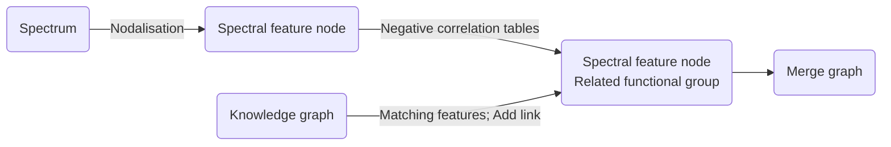
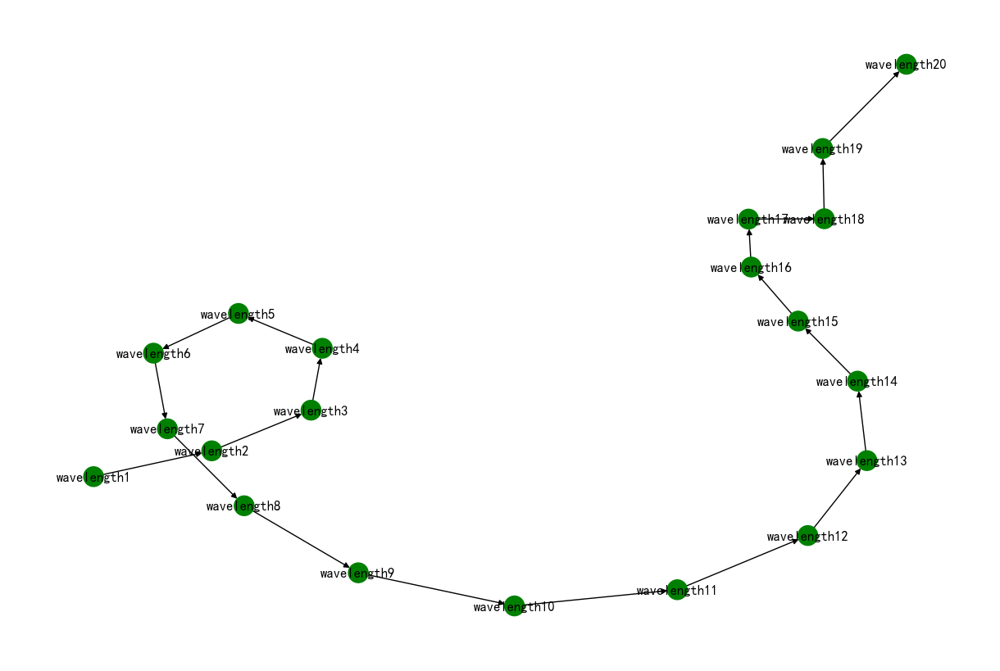
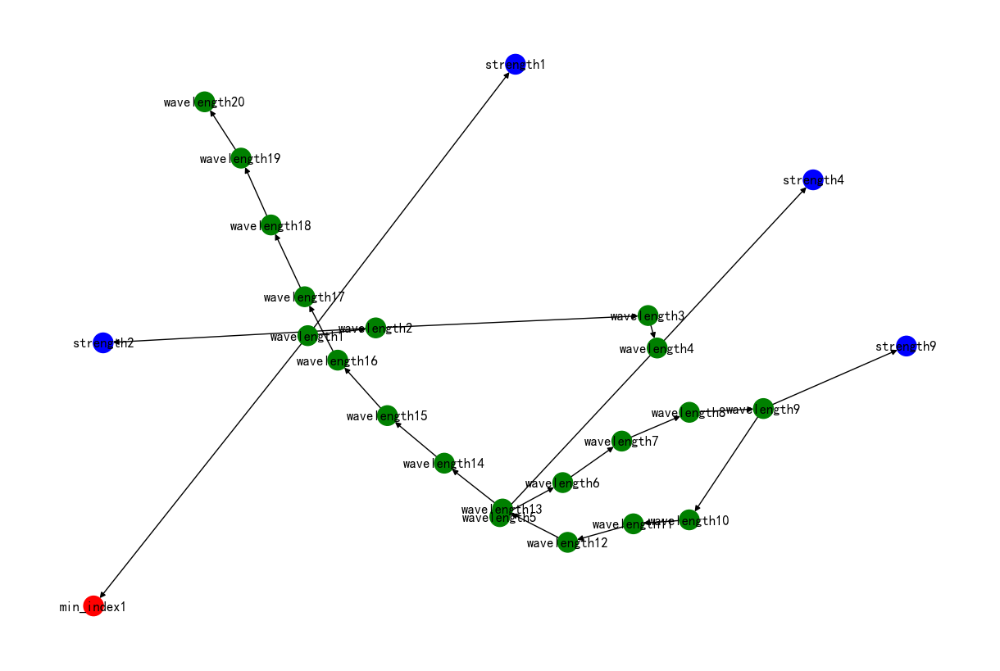
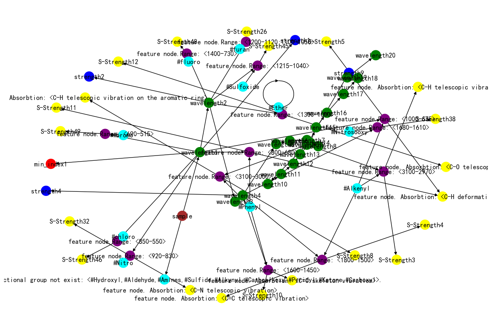
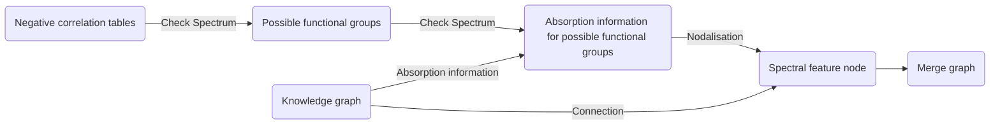

# 光谱信息融合化学知识图谱

对于任意单点光谱曲线，我们将其构建为图结构。该图结构能够留存光谱的特征形态及文本属性，同时，节点化的光谱曲线能够直接与知识图谱耦合，既提高了模型预测的精准度，又保证了可解释性。耦合后的图谱于节点和边线上保存了用以描述相关信息的文本内容，借助大模型进行语义编码以获取用于训练的特征矩阵和邻接矩阵，并依据任务需求填充prompt 节点，最终得到用于训练的任务图。如前文所述，大模型能够将文本信息投射至统一的高维语义空间中，故而，在本质上由文本描述的任务图上训练得到的小模型存在获取分布外泛化能力的可能。

在此，我们重点说明光谱曲线与知识图谱耦合的相关方法，大模型编码与构建任务图的部分将在下一节中阐述。

## 知识图谱与光谱曲线的耦合方法

### 方法1(目前的方法)

该方法的处理过程一般如下：

* 光谱节点化
* 遍历光谱的特征吸收节点，查询可能的官能团
* 将特征吸收节点与官能团的相应节点连接，获取耦合图谱



* 以小分子(C6H4)2为例：
2")

#### 1. 获取光谱中的吸收峰位置及其强度

* **实现方法1(目前的方法)**
  * **光谱节点化**：根据光谱在频率上的分布，将其均匀划分为n个区间。在实验中取n值为20。

   ```python
      wavelength1 Feature Node1. Wavelength: from <600.0> to <894.887898>.(Unit: number of waves)
      wavelength2 Feature Node2. Wavelength: from <895.0059> to <1189.893798>.(Unit: number of waves)
      wavelength3 Feature Node3. Wavelength: from <1190.0118> to <1484.899698>.(Unit: number of waves)
      wavelength4 Feature Node4. Wavelength: from <1485.0177> to <1779.905598>.(Unit: number of waves)
      wavelength5 Feature Node5. Wavelength: from <1780.0236> to <2074.911498>.(Unit: number of waves)
      wavelength6 Feature Node6. Wavelength: from <2075.029501> to <2369.917398>.(Unit: number of waves)
      wavelength7 Feature Node7. Wavelength: from <2370.035401> to <2664.923298>.(Unit: number of waves)
      wavelength8 Feature Node8. Wavelength: from <2665.041301> to <2959.929199>.(Unit: number of waves)
      wavelength9 Feature Node9. Wavelength: from <2960.047201> to <3254.935099>.(Unit: number of waves)
      wavelength10 Feature Node10. Wavelength: from <3255.053101> to <3549.940999>.(Unit: number of waves)
      wavelength11 Feature Node11. Wavelength: from <3550.059001> to <3844.946899>.(Unit: number of waves)
      wavelength12 Feature Node12. Wavelength: from <3845.064901> to <4139.952799>.(Unit: number of waves)
      wavelength13 Feature Node13. Wavelength: from <4140.070801> to <4434.958699>.(Unit: number of waves)
      wavelength14 Feature Node14. Wavelength: from <4435.076702> to <4729.964599>.(Unit: number of waves)
      wavelength15 Feature Node15. Wavelength: from <4730.082602> to <5024.970499>.(Unit: number of waves)
      wavelength16 Feature Node16. Wavelength: from <5025.088502> to <5319.9764>.(Unit: number of waves)
      wavelength17 Feature Node17. Wavelength: from <5320.094402> to <5614.9823>.(Unit: number of waves)
      wavelength18 Feature Node18. Wavelength: from <5615.100302> to <5909.9882>.(Unit: number of waves)
      wavelength19 Feature Node19. Wavelength: from <5910.106202> to <6204.9941>.(Unit: number of waves)
      wavelength20 Feature Node20. Wavelength: from <6205.112102> to <6500.0>.(Unit: number of waves)
   ```

   
   _这样做是最简单的光谱节点化方法，但是忽略了光谱本身的细致结构，同时也经常出现一个吸收峰被分割在两个区间中的情况_
&nbsp;

  * **特征吸收判定**：获取区间中的最小透射率，若最值小于90%，则判定该区间存在特征吸收。若该区间存在特征吸收，则使用蓝色节点进行标注并记录标准化的吸收强度。吸收强度标准混方法如下：将透射强度划分为5个等级，由1-5进行标注，当透射率位于20%-0%时，记录透射强度为5，以此类推。同时，标注最大吸收峰所在波长节点(目前未使用).
   

   ```python
   strength1 Feature Node1. strength: <5>
   min_index1 Feature Node. Minimum transmittance position: 0.618012360247205
   strength2 Feature Node2. strength: <3>
   strength4 Feature Node4. strength: <2>
   strength9 Feature Node9. strength: <5>
   ```

   _简单的特征吸收判定方法，可能可以修改成参考区间附近的吸收强度，目前相关内容不太重要。以后如果补充画图的部分，可以改进为强度编码。_
&nbsp;

* **实现方法2(待尝试)**
  * **光谱节点化**：通过求导等方法，直接获取光谱中存在吸收的位置，将其标注为特征区间，转化为节点
   _相较于之前方法的改进，理论上可以获取光谱的细致结构，也避免了分割吸收峰的问题_
&nbsp;

  * **特征吸收判定**：待尝试新的方法
&nbsp;

* **算法评估**
之前只设计并完成了整体流程，并没有设计与各个部分相关的评估方法，在进一步的研究中需要进行补充。
此节用于从光谱中获取相关的吸收特征，在随后的改进中，需尽可能地全面获取光谱曲线上的特征结构，可以据此设计相应的评估方法。

#### 2. 遍历知识图谱中的官能团信息，根据振动区间，将可能存在的官能团与光谱特征吸收相连

将光谱节点图中的特征吸收接入知识图谱中，与其中的官能团信息相关联。

* **实现方法1(目前的方法)**

  * **节点映射**：遍历光谱节点图中标注了特征吸收的节点，将其与知识图谱中记录的所有特征官能团吸收进行关联，从而获取不同节点的特征吸收可能对应的官能团信息，如下所示。例如，**在3070-3020存在振动吸收的官能团**可能是**光谱节点9**的特征吸收来源。

   ```python
   {'wavelength1': ['feature node.Range: <769-659>',
   'feature node.Range: <1000-675>',
   'feature node.Range: <700-590>',
   'feature node.Range: <800-680>',
   'feature node.Range: <900-700>',
   'feature node.Range: <850-550>',
   'feature node.Range: <920-830>',
   'feature node.Range: <690-515>'],
   'wavelength2': ['feature node.Range: <1200-1120;1100-1050>',
   'feature node.Range: <1215-1040>',
   'feature node.Range: <1400-730>',
   'feature node.Range: <1300-1000>',
   'feature node.Range: <1200-1000>',
   'feature node.Range: <940-900>',
   'feature node.Range: <1350-1000>'],
   'wavelength4': ['feature node.Range: <1640-1440>',
   'feature node.Range: <1755-1635>',
   'feature node.Range: <1680-1610>',
   'feature node.Range: <1600-1450>',
   'feature node.Range: <1750-1670>',
   'feature node.Range: <1750-1680>',
   'feature node.Range: <1800-1650>',
   'feature node.Range: <1800-1500>'],
   'wavelength9': ['feature node.Range: <3100-3000>',
   'feature node.Range: <3070-3020>',
   'feature node.Range: <3100-2970>']}
   ```

  * **对于任意的光谱特征节点，是否与特定官能团产生关联的判定方法如下**：
对于一个已经标注特征吸收的光谱区间，标注该区间的起始波段为<b><font color=red>start_wave</font></b>，末尾波段为<b><font color=red>end_wave</font></b>。遍历知识图谱中的**官能团红外振动吸收(5级)**：对于某基团的吸收区间，记起始波段为<b><font color=Blue>start_FG</font></b>，末尾波段为<b><font color=Blue>end_FG</font></b>。根据四点的分布模型，两个区间的叠加存在6种情况
       **1.** _[start_FG, end_FG, start_wave, end_wave]_
        此时两个区间不重合，该特征吸收与该基团的对应振动无关
       **2.** _[start_wave, end_wave, start_FG, end_FG]_
        此时两个区间不重合，该特征吸收与该基团的对应振动无关
       **3.** _[start_FG, start_wave, end_FG, end_wave]_
        此时两个区间重合，需通过计算判定该特征吸收与该基团是否有关：将基团的振动区间均分为n个子区间，计算子区间落在特征吸收区间中的个数，score=落在其中的个数/n。若score>=0.5，则认为该特征吸收与该基团可能有关。  
       **4.** _[start_wave, start_FG, end_FG, end_wave]_
        此时特征基团吸收区间落在特征吸收区间内，直接判定该特征吸收与该基团的对应振动可能有关。
       **5.** _[start_wave, start_FG, end_wave, end_FG]_
        此时两个区间重合，需通过计算判定该特征吸收与该基团是否有关：方法同3
       **6.** _[start_FG, start_wave, end_wave, end_FG]_
        此时特征基团吸收区间覆盖特征吸收区间，直接判定该该特征吸收与该基团的对应振动可能有关。
&nbsp;

* **实现方法2**
待进一步研究补充。
  
#### 3. 检索官能团负相关表，剔除可以确定不存在的官能团

官能团负相关表如下所示
Functional Group | Range |
---------|----------|
Amines (胺基), Hydroxyl (羟基) | [4000,3200] |
Alkynyl (炔基) | [3310,3300] |
Phenyl (苯基), Alkenyl (烯基) | [3100,3000] |
Carboalkoxy (酯基), Ketone (酮基), Carboxyl (羧基), Aldehyde (醛基) | [1870,1550] |
Alkenyl (烯基) | [1690,1620] |
Nitro (硝基) | [1600,1510] |
Phenyl (苯基), Pyridyl (吡啶) | [1600,1450] |
Sulfide (硫化物) | [1420,990] |

上表仍待修改和补充，有些地方不太准确，或者说在目前的代码下不太好用，例如羟基总是会被排除掉，之后通过改进代码可能会有所改善。**相关资料可参考：分析化学手册，柯以侃，705-706。**

* **实现方法1(目前的方法)**
  * **特征吸收判定**：
   遍历负相关表中记载的所有官能团，并检索光谱中的对应区域是否存在吸收，相关算法如下所示
    1. 获取负相关表中对应某一官能团的特征吸收范围，取出<b><font color=Blue>start_FG</font></b>与<b><font color=Blue>end_FG</font></b>
    2. 检索<b><font color=Blue>start_FG</font></b>与<b><font color=Blue>end_FG</font></b>具体落在了光谱节点图的哪一个节点中，相关节点用于进行负相关判断。若检索得到的两个节点非连续，则添加其中及其两端的所有节点；若连续或相同，则保留两个或一个节点
    3. 若检索得到的任一节点存在特征吸收，则认为负相关表中的该官能团可能存在，反之不存在
    4. 获取负相关表中的下一个官能团
&nbsp;

      以下为(C6H4)2进行负相关检索的结果

   ```python
      不存在的官能团['#Ketone', '#Carboxyl', '#Sulfide', '#Hydroxyl', '#Amines', '#Pyridyl', '#Alkynyl', '#Carboalkoxy', '#Aldehyde']
      可能存在的官能团['#Alkenyl', '#Phenyl', '#Nitro']
      根据光谱数据,可能存在的官能团有:
      [('#Alkenyl', 3), ('#Phenyl', 3), ('#chloro', 1), ('#Nitro', 1), ('#bromo', 1), ('#furan', 1), ('#Sulfoxide', 1), ('#fluoro', 1), ('#Ether', 1), ('#Nitrosooxy', 1)]
   ```

&nbsp;

* **实现方法2**
待进一步研究补充。

#### 4. 提取子图

考虑到若直接将混合后的节点图作为任务样本，图中事实上存在大量未相连，无重要关联的冗余信息，可能会影响模型对样本的处理能力，因此需要考虑提取子图的相关操作。

* **实现方法1(目前的方法)**
  * **知识图谱-光谱节点连接**：对于可能存在的官能团，连接方式如下
    * 对应光谱节点连接**特定官能团(4级)**的一个特征吸收，需要注意特征吸收还连接着图谱中的强度节点，用来说明这个特征吸收的红外振动形式。

  * **节点追溯**：对于混合后的节点图，以原始光谱节点为核心，向化学知识图谱中追溯相关的节点与连线。目前采样的方法是简单的获取2级邻近节点以及相关邻接信息。

      ```python
      fin = test_class.subgraph_extraction(hop=2)
      ```

  * **获取子图**：根据节点追溯的结果，以原始光谱为核心，生成子图。用于进一步的大模型编码并以及prompt 节点填充，最终获取用于训练的任务图。
   
&nbsp;

* **实现方法2(相关思路)**
  * **节点追溯**：从直接连接在光谱节点上的**特定官能团**(4级)追溯相关节点与边关系，对应的**子类物质**(3级)，**大类**(2级)和**化学官能团**(1级)都需要补充，而不是简单地获取邻近子图。
&nbsp;

  * **获取子图**：根据以上获取的节点，从混合图谱中获取子图

### 方法2

该方法的处理过程一般如下：

* 首先遍历官能团的负相关表，剔除可以确定不存在的官能团
* 遍历知识图谱中记录的剩余官能团振动信息，检索光谱曲线的相应部分，判断相关官能团是否存在，将可能存在的官能团与光谱特征吸收相连
* 将标注的连接区域进行节点化，并将光谱节点与官能团的相应节点连接，可忽略无标注的光谱区域
* 提取耦合子图



#### 1. 遍历官能团负相关表，剔除可以确定不存在的官能团

* **实现方法1(相关思路)**
  * **信息获取**：获取负相关表中特定官能团的<b><font color=Blue>start_FG</font></b>与<b><font color=Blue>end_FG</font></b>
  * **吸收判断**：检索光谱曲线的对应区域是否存在吸收，若存在，则认为该官能团可能存在，反之不存在
&nbsp;

#### 2. 逐一遍历知识图谱中剩余的官能团信息，根据官能团的振动区间，检索光谱的对应部分，判断相关官能团的对应吸收是否存在，将可能存在的官能团与光谱特征吸收相连

* **实现方法1(相关思路)**
  * **信息获取**：获取知识图谱中剩余的特定官能团的<b><font color=Blue>start_FG</font></b>与<b><font color=Blue>end_FG</font></b>
  * **吸收判断**：检索光谱曲线的对应区域是否存在吸收，若存在，则标注该区域与对应官能团的关联，反之不做处理
&nbsp;

#### 3. 将标注的连接区域进行节点化，并将光谱节点与官能团的相应节点连接

* **实现方法1(相关思路)**
  * **光谱节点化**：根据光谱曲线上标注的区域，将光谱节点化，可忽略无标注的光谱区域。注意，此处需尽可能使得节点化的部分不产生重叠，具体可以通过将重叠的标注区域合并为一个节点等操作实现，待研究
  * **获取混合图谱**：将光谱节点与对应官能团的**红外振动吸收**(5级)相连，获取混合图谱
&nbsp;

#### 4. 提取耦合子图

* **实现方法2(相关思路)**
  * **节点追溯**：从直接连接在光谱节点上的**特定官能团**(4级)追溯相关节点与边关系，对应的**子类物质**(3级)，**大类**(2级)和**化学官能团**(1级)都需要补充，而不是简单地获取邻近子图。
&nbsp;

  * **获取子图**：根据以上获取的节点，从混合图谱中获取子图