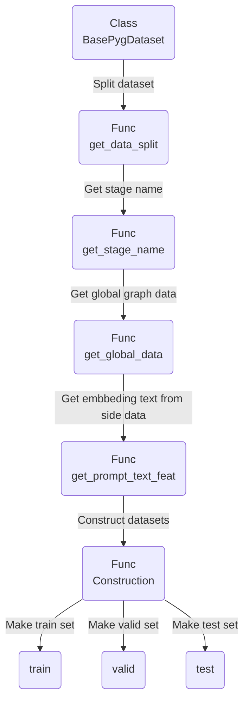

# 大模型编码与任务节点填充

对于从混合图谱中提取的子图，其节点和边线上保存了用以描述相关信息的文本内容，借助大模型进行语义编码以获取用于训练的特征矩阵和邻接矩阵，并填充与任务相关的prompt节点，最终得到用于训练的任务图。如前文所述，大模型能够将文本信息投射至统一的高维语义空间中，故而，在本质上由文本描述的任务图上训练得到的小模型存在获取分布外泛化能力的可能。

在此，我们重点说明大模型编码与构建任务图的相关方法。

## 大模型编码

抽象的编码过程已经编写在继承**InMemoryDataset**类(torch_geometric对数据进行预处理的基础类)的**BasePygDataset**中。
**BasePygDataset**以方法**process**对原始数据进行预处理，提供包括大模型编码，同类数据的包装等功能。
在光谱的化学官能团分类中，使用继承了**BasePygDataset**的**MolOFADataset**。

```python
def process(self):
    data_list, texts, side_data = self.gen_data() # gen_data用于堆叠文本信息，进行统一编码
    # 保存内容：图列表，List[pyg,...]；原始文本；任务文本
    torch.save(texts, self.processed_paths[1])  # 这里是节点，边等部分格式化后的文本信息 'cache_data\\Cora\\ST\\processed\\texts.pkl'
    if side_data is not None:
        torch.save(side_data, self.processed_paths[2])  # 这里是可提供给不同任务的prompt信息 'cache_data\\Cora\\ST\\processed\\data.pt'
    else:
        torch.save("No side data", self.processed_paths[2])

    if self.load_texts:
        data, slices = self.add_raw_texts(data_list, texts)
    else:
        if self.encoder.model is None:
            self.encoder.get_model()
        texts_emb = self.text2feature(texts,encoder=self.encoder)   # 实现文本的大模型编码
        data, slices = self.add_text_emb(data_list, texts_emb)   # 将编码向量填充至对应图谱

    print("Saving...")
    torch.save((data, slices, ), self.processed_paths[0], pickle_protocol=4)  # 这里对应预处理后的图文件以及索引 'cache_data\\Cora\\ST\\processed\\geometric_data_processed.pt'
    return data_list, texts, side_data
```

**注意**：此处存在默认读取数据路径，如下

```python
with open('./Datasets/Base_data/FG_graph.pkl', 'rb') as f: # 加载处理后的化学知识数据
            FG_graph = pickle.load(f)
with open('./Datasets/Base_data/Spectrum_graph.pkl', 'rb') as f: # 加载处理后的光谱数据
    Load_spec = pickle.load(f)
```

在运行**BasePygDataset**及其继承类后，若本地保存路径下不存在预处理后的数据文件，则重新进行预处理。这里官方似乎没有提供重复预处理本地文件的接口，相关的代码我还没有写，所以目前如果在前面的化学知识图谱/光谱数据上做出了变化，**需要将其重新保存至本地路径，并删除原先的预处理数据文件，并重新运行BasePygDataset的读取代码，才可以使用新的数据**。

```python
# 保存Spectrum_graph文件
with open('./Datasets/Base_data/Spectrum_graph.pkl', 'wb') as f:
    pickle.dump(Spectrum_graph, f)
# 保存FG_graph文件
with open('./Datasets/Base_data/FG_graph.pkl', 'wb') as f:
    pickle.dump(FG_graph, f)
```

&nbsp;

### 数据堆叠

实现该功能的封装函数为**gen_data**，如下

```python
def gen_data(self):
    with open('./Datasets/Base_data/FG_graph.pkl', 'rb') as f: # 加载处理后的化学知识数据
        FG_graph = pickle.load(f)
    with open('./Datasets/Base_data/Spectrum_graph.pkl', 'rb') as f: # 加载处理后的光谱数据
        Load_spec = pickle.load(f)
    datasets = (FG_graph, Load_spec)
    pyg_graph, texts, split = gen_graph(get_local_text(datasets))
    return [d for d in pyg_graph], texts, split
```

其中的核心函数为**get_local_text()**,**gen_graph()**
&nbsp;

#### get_local_text

根据上一节融合光谱信息和知识图谱的方法，对整个光谱数据集进行批量处理，保存为列表

```python
for name,spe_graph in tqdm.tqdm(Spectrum_graph.items()):
    test_class = Merge_PygDataset(FG_graph,spe_graph,Name=name)
    connected_dictionary = test_class.preprocess()      # 官能团信息：正相关
    all_Table,isexist,score_dict = test_class.Negative_relevant_information(is_print=False)   # 官能团信息：负相关
    OP = test_class.construct_graph(connected_dictionary,all_Table,is_print=False)        # 生成混合图谱
    fin = test_class.subgraph_extraction(hop=2)    # 生成邻近子图
    graph_list.append(test_class)
```

&nbsp;

#### gen_graph()

将数据集中所有节点的文本信息，边信息堆叠为矩阵的形式，方便后面做大模型的编码操作

* 获取关于图标签的说明 (针对分类任务)

```python
category_desc = pd.read_csv(
                os.path.join(r'G:\Research\Paper4-Code\2024_6_19\Log', "categories_aromatic.csv"), 
                sep=",").values
    ordered_desc = []
    label_name = ['Aromatic compound','Non-aromatic compound'] # 这里取的顺序与标签的实际含义相反，即实际上0代表非芳香族，1代表芳香族，为此后面做了一个标签反转的操作。在进行一些实验测试之后，似乎在二分类中，此处标签的语义是否反转对结果的影响不大，因为在训练的时候用于计算损失的是两个class_node上的01和10这样的编码形式，本质上就是把两类样本给分开了。但这样可能导致在F/S的相关测试里面效果不好，之后应该会调整这里。
    for i, label in enumerate(label_name):
        true_ind = label == category_desc[:, 0]  # 定位[False,...,True,...,False]
        ordered_desc.append((label, category_desc[:, 1][true_ind]))
    Labels_text = {desc[0]:
            "prompt node. Type of compound and description: " 
            + desc[0]
            + " . "
            + desc[1][0]
            for desc in ordered_desc
     } # 类别分类标签文本
```

* 获取节点文本与边文本

```python
node_texts = []      # 存放所有节点信息
edge_texts = []      # 存放所有边信息
y_texts_index = []   # 存放所有标签信息

# 堆叠所有图的节点，边信息
for g in graphs:
    sample_graph = g.GP.from_networkx_2_pyg(g.GP.finnal_graph)    # 转换为pyg格式，并整理所有相关信息
    node_attribute = sample_graph.node_attributes.copy()          # 获取节点属性
    edge_attribute = sample_graph.edge_attributes.copy()          # 获取边属性
    y_texts_index.append(Labels_text[g.Label])                    # 获取标签信息,之后还是改成根据字典进行获取好一点。0对应Label_name的第一个类别，1对应第二个类别
    node_text = [node_attribute[i]['raw_text'] for i in node_attribute]  # 节点信息统一以属性'raw_text'进行保存，要求所有节点具有该属性。
    for i in node_text:
        node_texts.append(i)
    for key,value in edge_attribute.items():
        if value:
            for name,edge_attr in value.items():
                edge_texts.append(edge_attr)    # 部分边属性可能为空，需要进行判断。边信息统一以属性'relation'进行保存。
            
# 去除列表中的重复部分，方便后续编码处理。
unique_node_texts = set(node_texts)
unique_edge_texts = set(edge_texts)
unique_y_texts_index = set(y_texts_index)

u_node_texts_lst = list(unique_node_texts)       # 列表：所有图中的节点信息，唯一存在
u_edge_texts_lst = list(unique_edge_texts)       # 列表：所有图中的边信息，唯一存在
u_edge_texts_lst.append('feature edge. general connection')  # 用于填充'raw_text'信息为空的边
u_y_texts_index_lst = list(unique_y_texts_index) # 列表：所有图中的标签信息，唯一存在

node_texts2id = {v: i for i, v in enumerate(u_node_texts_lst)}         # 该字典将节点信息转换为ID,例如{1:节点1的文本，2:节点2的文本}
edge_texts2id = {v: i for i, v in enumerate(u_edge_texts_lst)}         # 该字典将边信息转换为ID
y_texts_index2id = {v: i for i, v in enumerate(u_y_texts_index_lst)}   # 该字典将标签信息转换为ID，这里其实是和原来的g.Label是一样的
```

* 将所有图中的相关信息用index_ID进行替换

```python
for num, g in enumerate(graphs):
    sample_graph = g.GP.from_networkx_2_pyg(g.GP.finnal_graph)
    node_attribute = sample_graph.node_attributes.copy()
    edge_attribute = sample_graph.edge_attributes.copy()

    node_information_ID = [node_texts2id[node_attribute[i]['raw_text']] for i in node_attribute] # 将节点信息转换为ID

    edge_information_ID = [] # 将边信息转换为ID
    for key,value in edge_attribute.items():
        sample_edge_dict = {}
        if value: # 如果边属性存在，则通过字典转换为ID
            for name,edge_attr in value.items():
                sample_edge_dict[key] = {name :[edge_texts2id[value[name]]]}
        else: # 如果边属性不存在，则用固定格式进行填充
            #sample_edge_dict[key] = {'without' : [-9999]}
            sample_edge_dict[key] = {name :[edge_texts2id['feature edge. general connection']]}  # 对于无信息的边线，指明这条连线属于一般的连线，采用同一的格式
        edge_information_ID.append(sample_edge_dict)

    #nx_z = pyg.utils.to_networkx(sample_graph,to_undirected=False,to_multi=True)  # 非无向图，可存在多连接
    edge_index = sample_graph.edge_index  # 获取连接的边索引
    #edge_index = torch.tensor(list(nx_z.edges())).T  # 获取连接的边索引
    data_dict = sample_graph.to_dict()  # 将原始数据转换为字典,键值包括：
    # if data_dict['edge_index'] == edge_index:
    # print('same')
    data_dict['edge_index'] == edge_index
    new_data = pyg.data.data.Data(
        x=data_dict['x'],
        edge_index=data_dict['edge_index'],
        node_name = [data_dict['node_name']],
        node_attributes = [data_dict['node_attributes']],
        edge_attributes = [data_dict['edge_attributes']],
        node_ID = node_information_ID,
        edge_ID = edge_information_ID,
        y_label = y_texts_index2id[Labels_text[g.Label]],
        Name = g.Name if getattr(g, 'Name', None) else None
        #**data_dict
        )

    data.append(new_data)
    
    split[g.Mask].append(num)  # 根据train/valid/test分配该样本
```

* 补充边缘信息，包括prompt节点，class节点以及上述节点与原图中节点连接的边信息

```python
prompt_edge_text = [
"prompt edge.", 
"prompt edge. edge for query graph that is our target",
"prompt edge. edge for support graph that is an example", 
] # 边标签文本

prompt_text = [
"prompt node. node classification on the sample's category based on spectral information and knowledge graph",
"prompt node. few shot task node for graph classification that decides whether the query molecule belongs to "
"the class of support molecules.", 
]    # 提问prompt文本
    

prompt_text_map = {  # 获取构建不同任务图所需文本的索引
"e2e_graph": { # 用于实现一般端到端图任务的文本索引
    "noi_node_text_feat": [ #获取prompt节点文本的关键字与索引
    "noi_node_text_feat", [0]],

    "class_node_text_feat": [ #获取class节点文本的关键字与索引
    "class_node_text_feat",torch.arange(len(u_y_texts_index_lst))],

    "prompt_edge_text_feat": [ #获取prompt,class节点与原图连接边线的文本的关键字与索引
    "prompt_edge_text_feat", [0]]
    },

    "lr_graph": { # 用于实现F/Z相关任务的文本索引
    "noi_node_text_feat": [
    "noi_node_text_feat", [1]],

    "class_node_text_feat": [
    "class_node_text_feat",torch.arange(len(u_y_texts_index_lst))],

    "prompt_edge_text_feat": [
    "prompt_edge_text_feat", [0, 1, 2]]
    }
    }

ret = (data,    # 经过处理的图数据列表
    [
        u_node_texts_lst,    #  文本索引
        u_edge_texts_lst,    #  边索引
        u_y_texts_index_lst, #  标签索引
        prompt_edge_text,    #  连接prompt，class与原图的边线文本
        prompt_text,         #  prompt文本
        ],
    [
        split,               # train/valid/test 分割掩膜
        prompt_text_map      # 获取构建不同任务图所需文本的索引
        ],
        )
return ret
```

### LLM编码

* 可用LLM以及相关的维度信息如下表所示
    LLM | Size |
    ---------|----------|
    ST | 768 |
    BERT | 768 |
    e5 | 1024 |
    llama2_7b | 4096 |
    llama2_13b | 4096 |

    LLM的作用是将文本信息投影到统一的向量空间，从而使得自行训练的模型可以学习其中的语义信息。调用LLM的相关代码在"./Models/LLM"目录下,可参考具体代码。一般情况下，初次加载模型均需要从huggingface上下载对应的checkpoint，会花10-20分钟，且需要挂梯子。
&nbsp;

* 加载数据集后调用LLM进行编码，对应接口在**process**函数下:

    ```python
    texts_emb = self.text2feature(texts,encoder=self.encoder)  # LLM编码
    data, slices = self.add_text_emb(data_list, texts_emb)     # 将编码信息与图数据一起封装
    ```

    ```python
    def text2feature(self,texts,encoder):
        try: 
            judge = isinstance(texts[0], str)
            if judge:
                return self.data2vec(encoder,texts)
        except: 
            judge = isinstance(texts, dict)
            if judge:
                output_data = {key:{} for key,value in texts.edge_attributes.items()}
                collect_edge_name = []
                collect_edge_data = []
                for key, value in texts.items():
                    if value:
                        for name,attr in value.items():
                            collect_edge_name.append(f'{key}' + '_' + name)
                            collect_edge_data.append(attr)
                            #collect_data[name] = data2vec(encoder,attr)
                encode_data = self.data2vec(encoder,collect_edge_data)
                #print(np.array(collect_edge_name).shape)
                for i in range(len(collect_edge_name)):
                        output_data[eval(collect_edge_name[i].split('_')[0])][collect_edge_name[i].split('_')[1]] = encode_data[i]
                        #output_data[key] = collect_data
                return output_data
        return [self.text2feature(t,encoder) for t in texts]

    def data2vec(self,encoder, data: list[str]) -> torch.Tensor:
        r"""
        Encode a list of string to a len(data)-by-d matrix, where d is the output dimension of the LLM.
        """
        if encoder is None:
            raise NotImplementedError("LLM encoder is not defined")
        if data is None:
            return None
        embeddings = encoder.encode(data).cpu().numpy()
        return embeddings
    ```

    以标签的转换过程为例,如下,将标签转换为列表

    Label| Prompt Node | Vector |
    ---------|----------|----------|
    Non-aromatic compound | 'prompt node. Type of compound and description: Non-aromatic compound...' | array([ 4.26325165e-02,  1.41836936e-02, -2.43972032e-03,  2.61970353e-03,-8....02,  1.16256261e-02],dtype=float32)|
    Aromatic compound | 'prompt node. Type of compound and description: Aromatic compound...' | array([3.40694822e-02,  2.09155791e-02,  8.43522325e-03, -1.71573441e-02,1....02, -2.72868089e-02],dtype=float32) |

    根据样本的Label,在标签列表中获取对应的索引
    Sample Name | Label | Index |
    ---------|----------|----------|
    (C5F9) |  Non-aromatic compound | 0 |
    (C6H4)2 | Aromatic compound | 1 |

&nbsp;

## 构建用于训练的任务图

### 相关的配置文件

```python
task_config = task_config_lookup[task_names[0]]   # 获取任务配置
#{'task_level': 'e2e_graph',  # 任务级别：端到端图任务
# 'eval_pool_mode': 'mean',   # 评估池化模式
# 'eval_set_constructs': [    # 参与任务的数据集
# {'stage': 'train', 'split_name': 'train'},   # 训练阶段：采用Mask标记为'train'的
# {'stage': 'valid', 'split_name': 'valid'},   # 验证阶段：采用Mask标记为'valid'的
# {'stage': 'test', 'split_name': 'test'},     # 测试阶段：采用Mask标记为'test'的
# {'stage': 'test', 'split_name': 'train'},    # 测试阶段：采用Mask标记为'train'的
# {'stage': 'test', 'split_name': 'valid'}     # 测试阶段：采用Mask标记为'valid'的
# ],
# 'dataset': 'small_molecule'}    # 数据集名，此处随意，仅做记号

Stage_Config = task_config['eval_set_constructs'] 

dataset_config = data_config_lookup[task_names[0]]  # 获取该数据集的处理方法配置
# {'task_level': 'e2e_graph',              # 需要该数据集进行的任务级别
#  'dataset_splitter': 'Graph_splitter',   # 用于分割数据集的函数
#  'preprocess': None,                     # 数据集的预处理方法，可选
#  'construct': 'ConstructMolCls',         # 构建任务图的类
#  'args': {'walk_length': None},          # 附加参数，可选
#  'eval_mode': 'max',                     # 评估模式
#  'task': 'classification',               # 任务说明
#  'dataset_name': 'small_molecule',       # 数据集名称
#  'process_label_func': 'process_reverse_binary_label',  # 标签的处理方法，可选
#  'eval_metric': 'auc',                   # 评估指标
#  'eval_func': 'binary_auc_func',         # 评估函数
#  'num_classes': -1}                      # 分类任务所需，指明类别数，默认-1，自行计算样本类别

# 数据集字典化
test_dataset = {}              # 储存BasePygDataset形式的数据
test_dataset_split = {}        # 储存划分得到子数据集的掩膜
test_preprocess_storage = {}   # 储存数据集预处理的结果
test_datasets = {"train": [], "valid": [],"test": []}    # 储存构造任务图后的子数据集
test_stage_names = {"train": [], "valid": [], "test": []}# 储存获取子数据集的索引
```

&nbsp;

### 任务图构造流程



get_global_data部分在处理edge，node级别任务时可能用到，因为可能会需要连接图上的其他部分，但目前做的是图级别的任务，所以该函数为空。
&nbsp;

#### Func -> get_data_split

在此，通过不同的数据集分割工具，根据掩膜获取train，valid，test等部分

```python
test_dataset[dataset_config['dataset_name']] = dataset_output   # 加载总数据集
test_dataset_split, split_key = get_data_split(test_dataset,test_dataset_split,dataset_config)   # 根据stage划分不同的子数据集
```

```python
def get_data_split(
                   # self, 
                   dataset,
                   dataset_split,
                   dataset_config = None,
                   ):
    """
    Split data based on task_level
    """
    split_key = get_split_key(dataset_config)

    if split_key not in dataset_split:# 如果已经存在，则不需要再进行处理
        dataset_splitter = dataset_config.get("dataset_splitter") # 获取键值，例如'CiteSplitter'
        split = globals()[dataset_splitter](
                dataset[dataset_config["dataset_name"]]) if dataset_splitter else None  
        # 在全局中查询名为dataset_splitter的函数并调用，如果没有，则返回None
        # 在graph级任务中，采用简单的 Graph_splitter
        dataset_split[split_key] = split
    return dataset_split,split_key

def Graph_splitter(dataset):
    return dataset.get_idx_split()
```

&nbsp;

#### Func -> get_stage_name

编译的文本字符串，用来指明特定数据集的来源以及用途

```python
stage_name = get_stage_name(i, dataset_config)    # 获取对应的子数据集名称
```

```python
def get_stage_name(stage_config, dataset_config):
    return "-".join([stage_config["dataset"], get_split_key(dataset_config), stage_config["stage"],stage_config["split_name"]])
```

&nbsp;

#### Func -> get_global_data

如前所述，在graph级别的任务下空置该部分。

#### Func -> get_prompt_text_feature

用于获取三个部分的文本编码信息，即：

* **'noi_node_text_feat'**：prompt节点的文本编码信息
* **'class_node_text_feat'**：分类节点的文本编码信息
* **'prompt_edge_text_feat'**：连接prompt节点与其它节点的边信息

dict_keys(['noi_node_text_feat', 'class_node_text_feat', 'prompt_edge_text_feat'])

```python
prompt_feats = dataset_output.get_prompt_text_feat(dataset_config["task_level"]) # 
```

```python
def get_prompt_text_feat(self, task_name):
    """
    Return the list of prompt node/edge feature for the task.
    """
    task_map = self.get_task_map()  # 根据任务获取编码信息
    if task_name not in task_map:
        raise NotImplementedError(
            "Task " + task_name + " is not implemented for " + self.name + " dataset the implemented tasks are "
            + str(
                task_map.keys()))
    feat_ind = task_map[task_name]
    prompt_feats = {}
    for k in feat_ind:
        #prompt_feats[k] = getattr(self.data, feat_ind[k][0])[feat_ind[k][1]]  # 就在之前保存的信息里面找到对应的特征
        prompt_feats[k] = getattr(self, feat_ind[k][0])[feat_ind[k][1]]
    return prompt_feats
```

&nbsp;

#### Func -> Construction

构造用于训练，推理的任务图数据。

```python
data = ConstructMolCls(
        dataset = test_dataset[dataset_config['dataset_name']], # MolOFADataset(306)
        split = test_dataset_split[split_key],                  # Mask
        split_name = i["split_name"],   # 子数据集的名称，包括'train'/'valid'/'test'
        prompt_feats = prompt_feats,    # 编码文本
        to_bin_cls_func = dataset_config["process_label_func"] if dataset_config.get("process_label_func") else None,   # 标签的处理方法：这里写了一个反转标签，可忽略
        task_level = dataset_config["task_level"],  # 任务说明
        global_data = test_preprocess_storage[split_key],  # 在此任务下，为空
        **dataset_config["args"],  # 其余关键字参数
        )
```

在此任务中，用于构造任务图的类是ConstructMolCls，其继承关系如下所示


* **ConstructMolCls**：在小分子光谱图分类中使用
* **GraphListHierDataset**：用于处理构成列表的混合图谱，prompt节点的连线方式 -- 将feature2prompt，prompt2class分开连接
* **GraphListDataset**：用于处理构成列表的混合图谱，prompt节点的连线方式 -- 同时连接feature2prompt，prompt2class
* **GraphprocessDataset**：用于处理图级别的混合图谱任务
* **DataWithCollate**：抽象基类，提供构成任务图所需要的函数：
  * def \_\_init__(self)
  * def \_\_len__(self)
  * def \_\_getitem__(self, index)
  * def get_collate_fn(self)
&nbsp;

* 通过__getitem__对每一个样本获取prompt_graph

    ```python
    def __getitem__(self, index):
        feature_graph = self.make_feature_graph(index)          # 获取特征图
        prompt_graph = self.make_prompted_graph(feature_graph)  # 获取提示图
        ret_data = self.to_pyg(feature_graph, prompt_graph)     # 将特征图和提示图转换为pyg格式
        if "walk_length" in self.kwargs and self.kwargs["walk_length"] is not None:
            ret_data.rwpe = scipy_rwpe(ret_data, self.kwargs["walk_length"])
        return ret_data
    ```

  * func -> make_feature_graph

    ```python
    def make_feature_graph(self, index):
        """
        Create feature subgraph based on index
        Args:
            index: int
        Returns:
            feat: torch.Tensor, node vector representations
            edge_feat: torch.Tensor, edge vector representations
            edge_index: torch.Tensor, feature edge indices
            e_type: torch.Tensor, feature edge types most likely 0-vector
            target_node_id: torch.Tensor, the indices of NOI
            class_emb: class node vector representations
            binary_rep: one-/multi-hot label representations
        """
        g = self.g[self.data_idx[index]]  # 获取对应图样本
        edge_index = g.edge_index
        label = g.y      # tensor[0]
        # label_emb = self.class_emb(label).view(1, -1)
        node_feat = g.node_text_feat
        edge_feat = g.edge_text_feat
        e_type = torch.zeros(len(edge_index[0]), dtype=torch.long)   # 不同边线的种类，即：1.原图中的；2.连接prompt和原图的；3.连接prompt和class的
        target_node_id = list(range(len(node_feat)))
        label, emb, binary_rep = self.process_label(label)
        return node_feat, edge_feat, edge_index, e_type, target_node_id, emb, label, binary_rep
    ```

    * func -> make_prompted_graph

        ```python
        def make_feature_graph(self, index):
            """
            Create prompted graph based on feature graphs, prompt edge construction is based on self.prompt_edge_list.
            self.prompt_edge_list defines connection types, edge_type indices, and indices in to self.prompt_edge_emb.
            Refer to data.ofa_data.OFAPygDataset.get_edge_list for details.
            Args:
                feature_graph: output from self.make_feature_graph

            Returns:

            """
            g = self.g[self.data_idx[index]]  # 获取对应图样本
            edge_index = g.edge_index
            label = g.y      # tensor[0]
            # label_emb = self.class_emb(label).view(1, -1)
            node_feat = g.node_text_feat
            edge_feat = g.edge_text_feat
            e_type = torch.zeros(len(edge_index[0]), dtype=torch.long)   # 不同边线的种类，即：1.原图中的；2.连接prompt和原图的；3.连接prompt和class的
            target_node_id = list(range(len(node_feat)))
            label, emb, binary_rep = self.process_label(label)
            return node_feat, edge_feat, edge_index, e_type, target_node_id, emb, label, binary_rep
        ```

    一个标准的任务图样本主要包括以下参数

    ```python
    Data(
        x=[41, 768],               # 原节点38个，prompt节点1个，分类节点2个
        edge_index=[2, 116],       # 邻接矩阵，包括原边线，f2n，n2f，n2c四类，
                                   # 原边线 38，f2n 38，n2f 38，n2c 2
        edge_attr=[116, 768],      # 边线文本嵌入
        y=[1, 1],                  # 标签嵌入  [[0]]，以(C5H9)2为例，不属于芳香族，
                                   # 标签为[[0]]，反之为[[1]]
        edge_type=[116],           # 边线分类掩膜
        bin_labels=[41],           # 用于训练的二进制标签，在y=[[0]]的情况下，
                                   # bin_labels=[0,0,...,1,0]，表明在训练中选取的节点是倒数第二个，其得分最高; #在y=[[1]]的情况下,
                                   # bin_labels=[0,0,...,0,1]，表明在训练中选取的节点是倒数第一个，其得分最高
        Name=[1],                  # 样本名
        true_nodes_mask=[41],      # class掩膜，即最后两个
        noi_node_mask=[41],        # prompt掩膜，倒数第三个
        target_node_mask=[41],     # 原节点的掩膜
        feat_node_mask=[41],       # 同上
        sample_num_nodes=41,       # 该任务图具有的总节点数
        num_classes=2              # 分类节点数
        )
    ```

&nbsp;

#### make_Dataset

* **Train set**
由于不需要在这个数据集中封装评估函数等，所以直接添加到test_datasets中

    ```python
    test_datasets[i["stage"]].append(data)
    ```

* **Valid set/Test set**

    ```python
    eval_data = make_data(
        i["dataset"],                   # small_molecule
        data,                           # GraphListHierDataset
        i["split_name"],                # 'train'/'valid'/'test'
        dataset_config["eval_metric"],  # default 'auc', metric of evaluation
        dataset_config["eval_func"],    # 'binary_auc_func'
        dataset_config["num_classes"],  # default -1, the num of class
        batch_size=20,                  # the number of sample in one batch
        sample_size=-1,                 # 
        eval_mode=dataset_config["eval_mode"] # 'max'
        )  # 

    test_datasets[i["stage"]].append(eval_data)
    ```

    验证集和测试集用**DataWithMeta**的数据形式保存

    ```python
    def make_data(name, data, split_name, metric, eval_func, num_classes, **kwargs):
    # Wrap GraphTextDataset with DataWithMeta for easy evaluator construction
        return DataWithMeta(
            data, 
            kwargs["batch_size"], 
            sample_size=kwargs["sample_size"], 
            metric=metric,
            state_name=split_name + "_" + name, 
            classes=num_classes,
            meta_data={"eval_func": globals()[eval_func], "eval_mode": kwargs["eval_mode"]}, 
            )
    
    class DataWithMeta:
    def __init__(
            self,
            data: Dataset,
            batch_size: int,
            state_name: Optional[str] = None,
            feat_dim: int = 0,
            metric: Optional[str] = None,
            classes: Union[int, List[int]] = 2,
            is_regression: bool = False,
            meta_data: Any = None,
            sample_size: Optional[int] = -1,
    ):
        self.data = data
        self.batch_size = batch_size
        self.state_name = state_name
        self.feat_dim = feat_dim
        self.meta_data = meta_data
        self.metric = metric
        self.sample_size = sample_size
        if classes == -1:
            self.classes = data[0].num_classes   # 获取样本中的类别数
        self.classes = classes
        if isinstance(classes, list):
            self.num_tasks = len(classes)
        else:
            self.num_tasks = None
        self.is_regression = is_regression

    def pred_dim(self):
        if self.is_regression:
            return 1
        if self.num_tasks is not None:
            return self.num_tasks
        return self.classes
    ```

&nbsp;

### 任务图集格式

在经过以上流程处理后，获取的数据集格式如下

```python
test_datasets
"""
{
    'train': [<task_data.graph.graph_construct.GraphListHierDataset at 0x1a2e86e3b50>],
    'valid': [<task_data.eval_data_construct.DataWithMeta at 0x1a2e86e3ee0>],
    'test': [
        <task_data.eval_data_construct.DataWithMeta at 0x1a2e86e3bb0>,
        <task_data.eval_data_construct.DataWithMeta at 0x1a2e86e3e50>,
        <task_data.eval_data_construct.DataWithMeta at 0x1a2e86e3d60>
        ]
        }
"""
```
