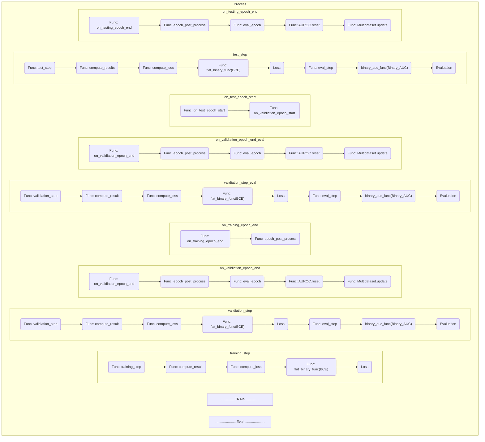
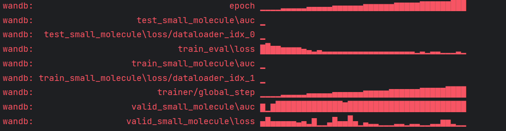

# 模型结构，训练模块和损失函数，评估工具

在此，我们对图神经网络的相关结构以及与之匹配的损失函数进行说明，同时也提供了用于评估训练结果的工具。

## 模型结构 (Structure of GNN)

```python
out_dim = params.emb_dim + (params.rwpe if params.rwpe is not None else 0)
# the dimension of vector in Model 'ST'
gnn = PyGRGCNEdge(      # Graph Neural Network, process message
    params.num_layers,  # 7 layers
    5,                  # num_rels
    out_dim,            # input_dim
    out_dim,            # output_dim    
    # Actually they are same thing under this task.
    drop_ratio=params.dropout, # default 0.15
    JK=params.JK,              # default None
)

bin_model = BinGraphAttModel if params.JK == "none" else BinGraphModel
# GNN model that use a single layer attention to pool final node representation across layers.
model = bin_model(
    model=gnn,                 # Basic GNN
    llm_name=params.llm_name,  # 'ST'
    outdim=out_dim,            # Output dimension
    task_dim=1,                # Only one task need to be finished
    add_rwpe=params.rwpe,      # default None
    dropout=params.dropout     # default 0.15
    )
```

&nbsp;

```python
model
"""
BinGraphAttModel(
  (model): PyGRGCNEdge(
    (conv): ModuleList(
      (0): RGCNEdgeConv(768, 768)
      (1): RGCNEdgeConv(768, 768)
      (2): RGCNEdgeConv(768, 768)
      (3): RGCNEdgeConv(768, 768)
      (4): RGCNEdgeConv(768, 768)
      (5): RGCNEdgeConv(768, 768)
      (6): RGCNEdgeConv(768, 768)
    )
    (batch_norm): ModuleList(
      (0): BatchNorm1d(768, eps=1e-05, momentum=0.1, affine=True, track_running_stats=True)
      (1): BatchNorm1d(768, eps=1e-05, momentum=0.1, affine=True, track_running_stats=True)
      (2): BatchNorm1d(768, eps=1e-05, momentum=0.1, affine=True, track_running_stats=True)
      (3): BatchNorm1d(768, eps=1e-05, momentum=0.1, affine=True, track_running_stats=True)
      (4): BatchNorm1d(768, eps=1e-05, momentum=0.1, affine=True, track_running_stats=True)
      (5): BatchNorm1d(768, eps=1e-05, momentum=0.1, affine=True, track_running_stats=True)
      (6): BatchNorm1d(768, eps=1e-05, momentum=0.1, affine=True, track_running_stats=True)
    )
  )
  (llm_proj): Linear(in_features=768, out_features=768, bias=True)
  (mlp): MLP(768, 1536, 768, 1)
  (att): SingleHeadAtt()
)
"""
```

&nbsp;

## 训练模块 (Training module)

在相关的代码中，主要采用**lightning.pytorch**库来实现torch的相关代码。在**lightning.pytorch**中，train/valid/test的运转处理方法需要单独设置。
此外，参数**data_multiple**和**min_ratio**用在多个训练数据集时添加相关权重，在训练数据单一时默认为1。

```python
train_data = make_train_data(           # 处理训练集
    test_datasets,
    data_multiple, 
    min_ratio, 
    data_val_index=val_task_index_lst)
text_dataset = make_full_dm_list(      # 合并为可供lightning.pytorch处理的数据流
    test_datasets, 
    data_multiple, 
    min_ratio, 
    train_data
)
params.datamodule = DataModule(
    text_dataset, 
    gpu_size=gpu_size, 
    num_workers=params.num_workers
)
```

### func -> make_train_data

构造训练数据类

``` python
def make_train_data(datasets, multiple, min_ratio, data_val_index=None):
        train_data = MultiDataset(         # 储存训练集的相关类
            datasets["train"],             # 训练数据
            data_val_index=data_val_index, # 标志验证集的索引，此处无用
            dataset_multiple=multiple,
            patience=3, 
            window_size=5, 
            min_ratio=min_ratio, 
            )
        return train_data

class MultiDataset(DatasetWithCollate):
    """
    One dataset that wraps different GraphTextDataset for training. It also
    dynamically manage the portion of the training datasets in each epoch 
    based on validation results.
    """
```

### func -> make_full_dm_list

将train/valid/test加载为完整列表

``` python
def make_full_dm_list(datasets, multiple, min_ratio, train_data=None,**kwargs):
        text_dataset = {
            "train": DataWithMeta(
              make_train_data(datasets, multiple, min_ratio) if not train_data else train_data,
              batch_size=20, 
              sample_size=-1, 
              ),
            "val": datasets["valid"],
            "test":datasets["test"], 
            }
        return text_dataset

class DataWithMeta:
  def __init__(
          self,
          data: Dataset,
          batch_size: int,
          state_name: Optional[str] = None,
          feat_dim: int = 0,
          metric: Optional[str] = None,
          classes: Union[int, List[int]] = 2,
          is_regression: bool = False,
          meta_data: Any = None,
          sample_size: Optional[int] = -1,
  ):
      self.data = data
      self.batch_size = batch_size
      self.state_name = state_name
      self.feat_dim = feat_dim
      self.meta_data = meta_data
      self.metric = metric
      self.sample_size = sample_size
      if classes == -1:
          self.classes = data[0].num_classes
      self.classes = classes
      if isinstance(classes, list):
          self.num_tasks = len(classes)
      else:
          self.num_tasks = None
      self.is_regression = is_regression

  def pred_dim(self):
      if self.is_regression:
          return 1
      if self.num_tasks is not None:
          return self.num_tasks
      return self.classes
```

输出结果如下

```python
text_dataset
"""
{'train': <task_data.eval_data_construct.DataWithMeta at 0x1260c86b4f0>,
 'val': [<task_data.eval_data_construct.DataWithMeta at 0x1260cbbac20>],
 'test': [<task_data.eval_data_construct.DataWithMeta at 0x1260cbbaa40>,
  <task_data.eval_data_construct.DataWithMeta at 0x1260cbbad40>,
  <task_data.eval_data_construct.DataWithMeta at 0x1260cbb9bd0>]}
"""
```

### Class ->  DataModule

```python
class DataModule(LightningDataModule)
    def __init__(
                self,
                data: Dict[str, DataWithMeta],
                gpu_size=1,
                num_workers: int = 0,
                pin_memory=True,
        ):
          super().__init__()
          self.datasets = data
          self.gpu_size = gpu_size
          self.num_workers = num_workers
          self.pin_memory = pin_memory

    def create_dataloader(self):
      """
      # creating dataloader for lightning
      """

    def train_dataloader(self):
      """
      # creating train_dataloader for lightning
      """
    
    def val_dataloader(self):
      """
      # creating val_dataloader for lightning
      """

    def test_dataloader(self):
      """
      # creating test_dataloader for lightning
      """
```

## 损失函数和评估工具 (Loss function and Evaluation kit)

```python
eval_metric = [dt.metric for dt in eval_data]                # 'auc'
eval_funcs = [dt.meta_data["eval_func"] for dt in eval_data] # binary_auc_func
loss = torch.nn.BCEWithLogitsLoss() # 用于训练的损失函数
```

根据eval_metric,获取对应的评估函数

```python
evlter
"""
[BinaryAUROC(), BinaryAUROC(), BinaryAUROC(), BinaryAUROC()]
"""
```

```python
metrics = EvalKit(
    eval_metric,              #  ['auc',]
    evlter,                   #  [BinaryAUROC(),]
    loss,                     #  训练和评估阶段统一的损失函数：BCEWithLogitsLoss()
    eval_funcs,               #  binary_auc_func
    flat_binary_func,         #  get class score
    eval_mode=dataset_config['eval_mode'], # 'max'
    exp_prefix="",    # 记录前缀
    eval_state=eval_state,  # 文本记号
    val_monitor_state=val_state[0],
    test_monitor_state=test_state[0],    
)
```

### 损失函数，统一在训练过程中和验证过程中

整体的训练框架在Class -> BaseTemplate(LightningModule)中，重要函数如下：

```python
class BaseTemplate(LightningModule):# 训练循环之类的应该都在这里
    def __init__(
        self,
        exp_config: ExpConfig,
        model: torch.nn.Module,
        eval_kit: Optional[EvalKit] = None,
        name: str = "",
    ):
        super().__init__()
        self.exp_config = exp_config
        self.model = model   # 模型部分
        self.name = name
        self.eval_kit = eval_kit   # 训练损失函数与评估/测试部分
    
    def configure_optimizers(self):

    def compute_results(self):
    
    def training_step(self):

    def on_train_epoch_end(self):

    def validation_step(self):

    def on_validation_epoch_end(self):

    def test_step(self):

    def on_test_epoch_end(self):

    def epoch_post_process(self):  
    # 在一个批次的末尾，判断是否需要进行验证或测试
```



#### 训练过程中损失函数的计算

损失计算过程包括两个函数，一个用于从图中获取特定节点的output，另一个是设计好的损失函数

```python
def compute_loss(self, output: Any, batch: Any):
    # 用在训练/验证/测试过程中，作为损失函数进行计算，先获取class_node
    return self.loss_func(self.loss, output, batch)   
    # flat_binary_func(BCEWithLogitsLoss())
```

1. 得分处理函数，即self.loss_func：从堆叠的数据中获取特定节点的output，在本任务中需要获取不同的class节点上的得分。此处采用func -> flat_binary_func

```python
def flat_binary_func(func, output, batch):
    labels = batch.bin_labels[batch.true_nodes_mask]    # true_nodes_mask指的是用于获取class_node的掩膜。这一步得到的是真实的标签
    valid_ind = labels == labels  # 这个其实就是个掩膜。 [True,...,True,...,True]
    return func(output.view(-1)[valid_ind], labels[valid_ind])
```

2.损失函数：此处采用BCEWithLogitsLoss()。该损失函数在一个单独的层中混合了Sigmoid激活函数和传统的BCE损失函数，使得分归一化在[0,1]之间。BCE损失函数的计算公式如下

$\frac{1}{2}
\ell(x, y) = L = \{l_1,\dots,l_N\}^\top, \quad l_n = - w_n \left[ y_n \cdot \log \sigma(x_n)+ (1 - y_n) \cdot \log (1 - \sigma(x_n)) \right],$
$.. math::
\ell(x, y) = \begin{cases}
            \operatorname{mean}(L), & \text{if reduction} = \text{`mean';}\\
            \operatorname{sum}(L),  & \text{if reduction} = \text{`sum'.}
        \end{cases}
$


#### 评估过程中获取评估指标

在评估过程中获取的评估指标同样包括两个函数，一个用于从图中获取特定节点的score，另一个是设计好的评估函数，例如Accuracy，AUC等

```python
return self.evlter_func[state](evlter, output, batch)  
# binary_auc_func(BinaryAUC())   
```

1. evlter_func对应func -> binary_auc_func,用于从图中获取特定节点的预测值

```python
def binary_auc_func(func, output, batch):
    output = output.view(-1, batch.num_classes[0])    # 变成两列，【num,2】
    # score = torch.sigmoid(output)[:, -1]
    score = torch.nn.functional.softmax(output, dim=-1)[:, -1]   #
    return func(score, batch.y[:, -1].view(-1))
```

需要说明的是：假设：
score=[0.4126, 0.4125, 0.4125, 0.4125, 0.4124, 0.4129, 0.4125, 0.4127, 0.4128,0.4128, 0.4124, 0.4124, 0.4127, 0.4124, 0.4126, 0.4124, 0.4125, 0.4127,
0.4126, 0.4126]；
target=[0,0,0,1,1,0,0,0,0,1,0,0,1,1,1,1,1,0,0,0]

以上结果表示在score的每一行中，经过softmax归一化后，均是第一列取大值，例如：【【0.5874，0.4126】，】。该预测结果可以近似对应二进制编码：【1，0】。以上预测的二进制编码，对应标签0。

采用以上表示形式，可以方便AUC的评估指标计算。相关说明如下：若score值小于0.5，其对应的预测标签为0，此时计算评估指标有两种情况：1.若真实的标签为0，我们希望AUC取得优秀的值，而0.4126的score可以对应target中的0，因此AUC取得优秀的值；2.若真实的标签为1，我们希望AUC取得较差的值，此时小于0.5的score值与其不匹配，0.4126的score不能对应target中的1，因此AUC取得较差的值

换句话说，当target为0时，若softmax后结果为【1，0】时，此时预测标签为0，且score与target匹配，AUC取得最优值；当target为1时，若softmax后结果为【0，1】时，此时预测标签为1，且score与target匹配，AUC取得最优值

## 训练结果

### 相关任务：对小分子是否为芳香族物质进行分类

本来是希望仅对芳香族进行分类，但芳香族的样本只有20几个，数目较少，另一方面是在官能团的连接中，芳香族和含有双键的物质的吸收峰重合度较高，连接出来的图差不多，有点难以区分，原因在于之前写的连接代码相对粗糙，连接的效果不好。之后将这个部分的代码重新写过后，可能可以修正该问题。
综上，我们在数据集里面把部分包含双键的物质也算在正向样本里，本质上是因为连接出来的图和真正的芳香族基本一致，之后修正相关代码后，该问题会自然修正，不会对结果产生影响。

* **(C6H4)2**
[('#Phenyl', 3), ('#Alkenyl', 3), ('#bromo', 1), ('#Nitro', 1), ('#chloro', 1), ('#fluoro', 1), ('#Sulfoxide', 1), ('#furan', 1), ('#Ether', 1), ('#Nitrosooxy', 1)]

* **C2H4**
[('#Phenyl', 3), ('#Alkenyl', 2), ('#bromo', 1), ('#chloro', 1), ('#Sulfide', 1), ]

* **(CH3)2CHC=OOH**
[('#Phenyl', 4), ('#Pyridyl', 3), ('#Alkenyl', 3), ('#Carboxyl', 3), ('#Carboalkoxy', 2), ('#bromo', 1), ('#iodo', 1), ('#chloro', 1), ('#Sulfide', 1), ('#Nitro', 1), ('#fluoro', 1), ('#Sulfoxide', 1), ('#furan', 1), ('#Ether', 1), ('#Disulfide', 1), ('#Alkyl', 1), ('#Sulfonyl', 1), ('#CarbonateEster', 1), ('#Ketone', 1), ('#Nitrosooxy', 1), ('#Aldehyde', 1)]

* 训练样本介绍：

Molecular formula | Name | Functional group | Class | Label:aromatic
---------|----------|---------|---------|---------
 (C5F9)2 | Perfluorodecalin | 卤素；脂环 | 卤代烃-含卤化合物/脂环族 | Non-aromatic compound|
 (C6H4)2 | Naphthalene;萘 | 萘环 | 芳香烃-烃类/芳香族 | Aromatic

* Train/Valid/Test
6:2:2  ==  182:60:60

* 简单训练50个epoch的结果

训练损失：
train_small_molecule\loss:**0.080±0.000000**
valid_small_molecule\loss:**0.305284±0.000000**
test_small_molecule\loss:**0.368243±0.000000**

评估的AUC结果：
train_small_molecule\auc:**0.998791±0.000000**
valid_small_molecule\auc:**0.958843±0.000000**
test_small_molecule\auc:**0.956989±0.000000**